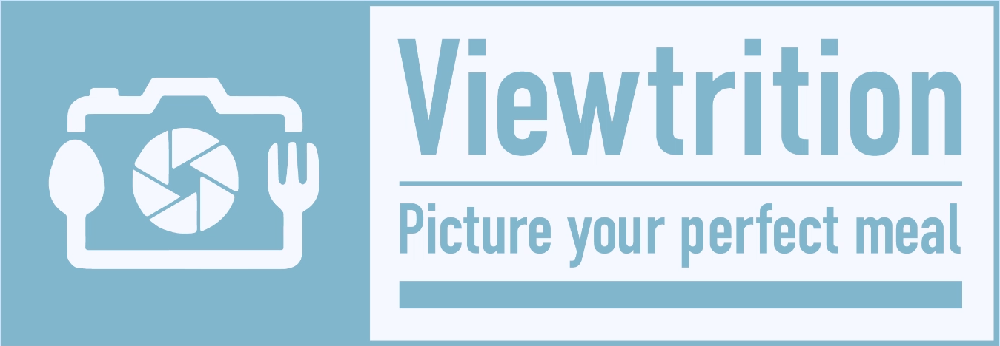
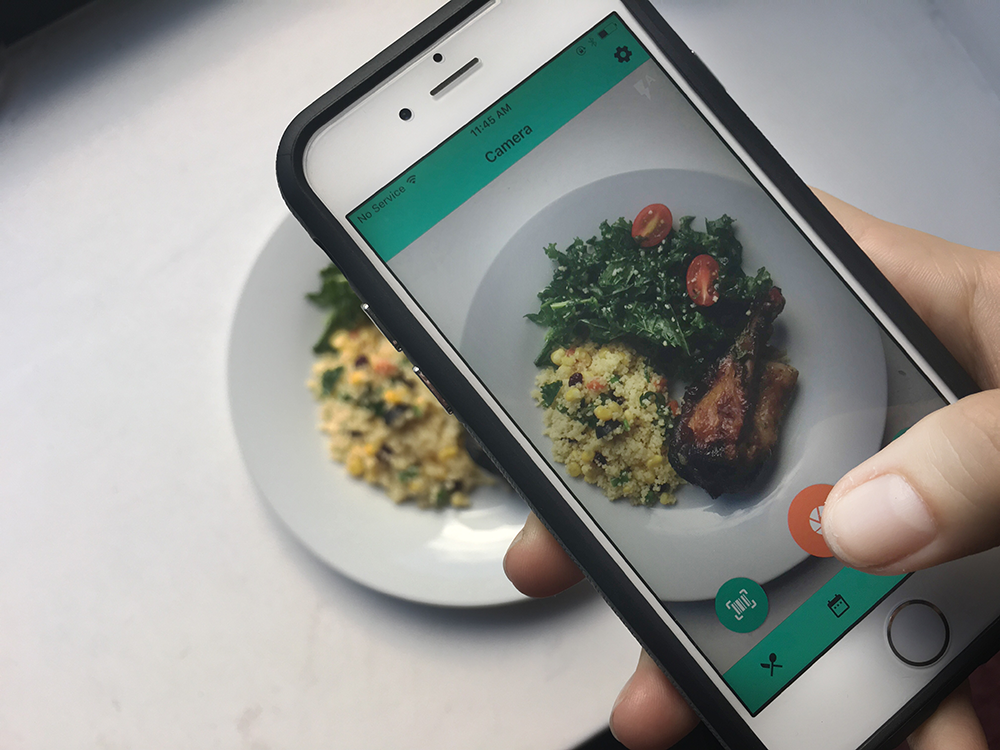

## Viewtrition
A mobile app that allows user to track and visualize their nutrition with the snap of a picture.
 
### How to Download Viewtrition:
Open Expo and scan:  
  
[https://expo.io/@kapicaluk/viewtrition](https://expo.io/@kapicaluk/viewtrition)  

Currently Avaliable for iOS only. If you use an android device, see below for instructions for running Viewtrition on a Mac OS device.
 
### Running Viewtrition on Your Computer:
If you do not have an iOS device, you can clone this repo and run it on your Mac OS device using the script 'npm-run-ios'. Node.js and npm must be installed. For more information on running an app created with create-react-native-app, visit [create-react-native-app on GitHub](https://github.com/react-community/create-react-native-app).

### How To Use Viewtrition:
* Create an account
* Snap a picture of your food
* Tap to select the foods you are eating
* Check out your nutrition information visualized on graphs and charts

### Technology Stack:
* React Native (via create-react-native-app)
* Expo
* Firebase
* Redux
* React Native Elements
* Victory Charts
#### APIs Used:
* [Clarifai](https://www.clarifai.com/)
* [Nutritionix](https://developer.nutritionix.com/)

### Viewtrition Team:
* [Gabriel DeFazio](https://github.com/gabrieldefazio)
* [Lucy Sutton](https://github.com/lucysutton91)
* [Łukasz Kapica](https://github.com/kapicaluk)
* [Sarah Katz](https://github.com/SarahLKatz)

Powered by [Fullstack Academy](https://www.fullstackacademy.com/) and [NYC Tech Talent Pipeline](http://www.techtalentpipeline.nyc/).
